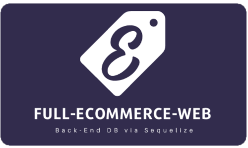

  

<h3 align="center">Full E-Commerce Web</h3>

---

 Complete and fully functioning back-end database for your e-commerce front-end!
      

## 

- [About](#about)
- [Installing](#installing)
- [Usage](#usage)
- [Built With](#built_using)
- [Authors](#authors)
- [Questions](#questions)

## 

This repository is where I ([Rae Alejandrino](https://github.com/raealejandrino/)) develop a back-end database using Sequelize and ORM concepts to implement with any e-commerce front-end. Whether you're looking to sell clothes or local groceries, this application can help organize your database to satisfy the needs of any front-end foundation.

## 

Once you have cloned the repo down from GitHub, you will want to run `npm install` in the command line to install all of the Node Modules needed to run the application.

## 

In order to run this program locally you will need to:

1. Clone this repository to receive all the files.
2. Run `npm install` in the terminal to download all the needed dependencies (makes sure you are in the correct file directory).
3. Run `source db/schema.sql` in your MySQL command line interface to initialize the database
4. (OPTIONAL) Run `npm run seed` to initialize seeding scripts to insert test data into the database
5. Run `npm start` in the terminal to start a live server locally.
6. Use any preferred application to call API routes defined within JavaScript files in the routes directory.

## 

- JavaScript
- Sequelize
- MySQL
- Express.js
- Node.js

## 

- [@raealejandrino](https://github.com/raealejandrino)
- See also the list of [contributors](https://github.com/coding-boot-camp/fantastic-umbrella/graphs/contributors) who participated in this project.

## 

- Feel free to open an issue or contact me directly at raealejandrino@gmail.com if you have any questions about the repo. You can find more of my work at [raealejandrino](https://github.com/raealejandrino/).

## License

Copyright (c) Microsoft Corporation. All rights reserved.

